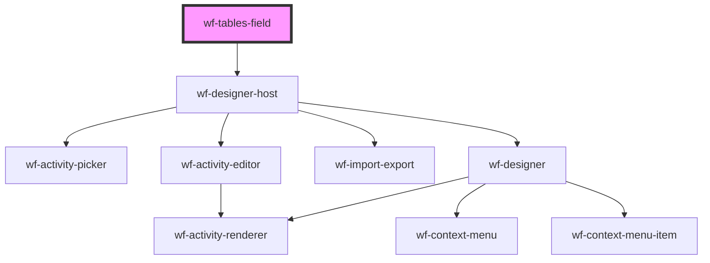

# wf-tables-field

<!-- Auto Generated Below -->

## Properties

| Property | Attribute | Description | Type      | Default     |
| -------- | --------- | ----------- | --------- | ----------- |
| `name`   | `name`    |             | `string`  | `undefined` |
| `value`  | `value`   |             | `boolean` | `false`     |

## Events

| Event             | Description | Type                                                                  |
| ----------------- | ----------- | --------------------------------------------------------------------- |
| `displayWorkflow` |             | `CustomEvent<{ activities: Activity[]; connections: Connection[]; }>` |

## Dependencies

### Depends on

- [wf-designer-host](..\workflow-designer\designer-host)

### Graph

----------------------------------------------

*Built with [StencilJS](https://stenciljs.com/)*
