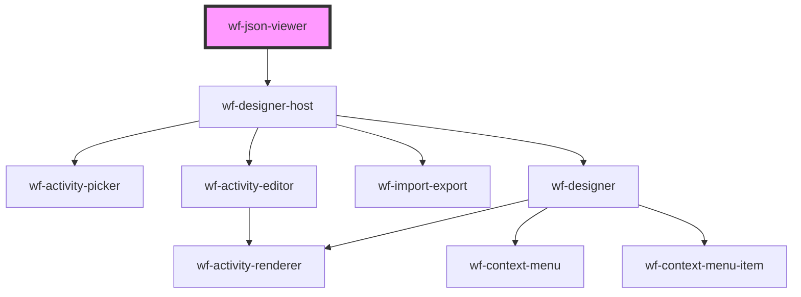

# wf-json-viewer

<!-- Auto Generated Below -->

## Dependencies

### Depends on

- [wf-designer-host](..\workflow-designer\designer-host)

### Graph

----------------------------------------------

*Built with [StencilJS](https://stenciljs.com/)*
